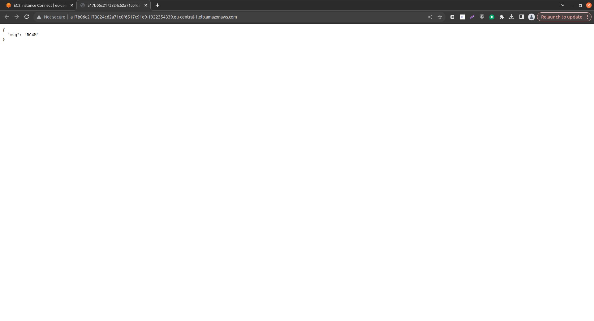
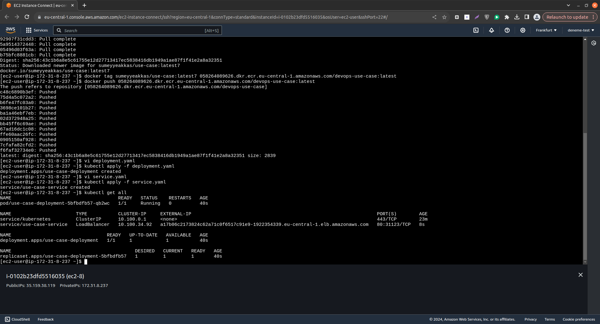

# DevOps Engineer Use Case Study

**Problems encountered while building the application and how to deal with:**
- **Kubernetes Networking Issues:** Faced networking issues and needed to examine pod logs. It was initially unclear how to proceed, so I decided to use kubectl describe on my pod to investigate further. That's the point of kubernetes networking issues.

- **CrashLoopBackOff Status:** My pod was stuck in a CrashLoopBackOff status. The logs were instrumental in identifying that the issue was due to a misconfigured Dockerfile, specifically an incorrect application file path.

- **Liveness/Health Endpoint Issues:** There were issues connecting to the liveness/health endpoint when accessing my app through the browser. Again, examining the logs revealed that the Kubernetes service was repeatedly restarting the application due to incorrect service configuration, making the app unreachable.

- **Container and Pod Debugging:** Occasionally needed to exec into my Docker containers and pods to troubleshoot issues.

- **AWS EC2 and EKS configuration:** You can reach application therough load balancer aoutomatic assigned URL : `http://a17b06c2173824c62a71c0f6517c91e9-1922354339.eu-central-1.elb.amazonaws.com/`

